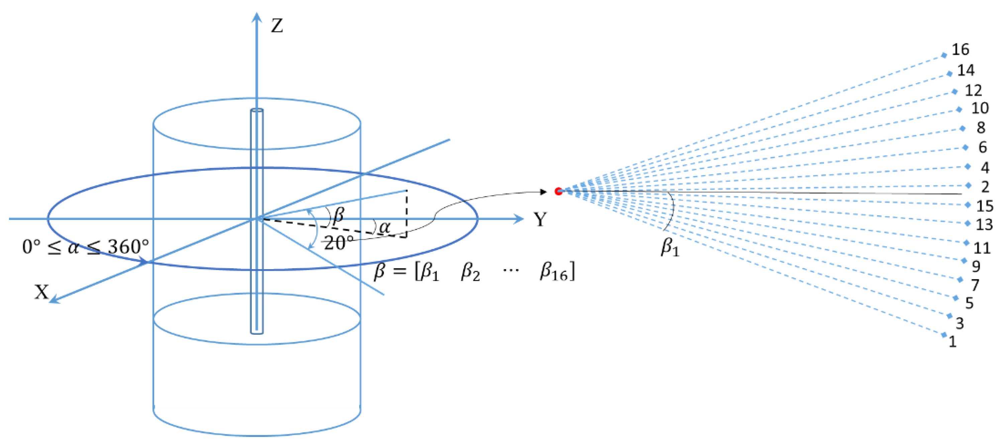
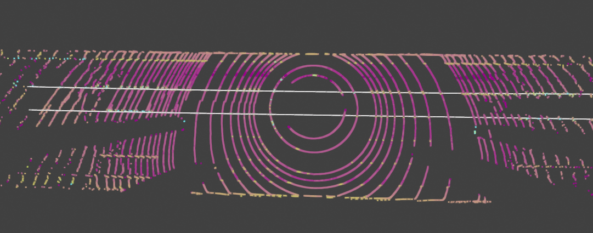

# Seoul Robotics Coding Assignment - Ego Lane Detection


### Task description

Thank you for your interest in joining our journey. The requirement of this task to develop an algorithm to detect the `ego lane lines` giving pointcloud data. The ego vehicle is located at the origin (0,0). For each pointcloud binary file in `pointclouds` folder, your algorithm should return a 3-degree polynomial fitting of the left and right ego lane. We only care about the top view result so the fitting is to express the relation of `y` to `x`.
```
y = coef[0] * x ** 3 + coef[1] * x ** 2 + coef[2] * x + coef[3]
```
We provide a sample output (see in `sample_output`) for the first pointcloud. The output file has two lines, the first line is the polynomial coefficients of the left lane and the second line is the polynomial coefficients of the right lane.

### Data explanation

If you use python to read pointcloud from binary file (which contains x, y, z, intensity and lidar_beam of points) you cloud use numpy package:
```
points = numpy.fromfile(bin_file, dtype=np.float32).reshape(-1, 5)
```
`len(points)` is then the number of points in the pointcloud. Each point, e.g, `point = points[0]` has `5` values (`len(point) == 5`) where

+ `point[:3]` are x, y, z coordinate of the point
+ `point[3]` is the intensity value of the point. Intensity is the reflected level of the point. The higher value is the more reflected it is (brighter it is). The value of intensity varies from 0 to 255 (0, 1, .., 255). This value is important to distinguish between lane point and non-lane point.
    * the intensity relfects the color freuqnecy embedded in the reflective scatter
    * source: https://www.jianshu.com/p/1ac4286cfabd
+ `point[4]` is lidar beam value. The lidar which produces this data is a spinning lidar and has 64 vertical beams. Lidar beam value can have the value from 0 to 63 (The lidar in the image have 32 beams instead)



### Data Visualization
We provide a sample code `data_visualize.py` to visualize the pointcloud (and the lane line if the output file is available) using `open3D` to help you quickly check the data. But you are free to use any method/library you prefer while developping your logic. If you want to use provided `data_visualize.py`, please check the dependency in `vis_requirement.py`. With `conda`, you can set it up as follows
```
conda create --name lane_test python==3.8
conda activate lane_test
pip install -r vis_requirement.txt
python data_visualize.py
```
In the visualizer, you can go back/forward between frames using lef/right arrow keys and Esc key to exit the visualizer.




### Requirements
To ensure a fair recruitment process, please adhere to the following requirements for your submission:
1. Language Choice: You can use either Python, C++, or a combination of both for the test.
2. Code Quality: We place a significant emphasis on code quality. Please provide a clear, well-documented, and organized repository for your submission. This includes writing clean, readable code with appropriate comments and documentation.
3. Lane Detection Outputs: Please Include your lane detection outputs in the format similar to the samples provided in the "sample_output" folders. This will allow us to assess the quality and accuracy of your detection results.
4. Report and Method Explanation: Alongside the code, please provide a report that explains your approach and methodology. You can present this report in PDF, Markdown (md), Jupyter Notebook, or any other suitable format. Ensure the report includes a detailed explanation of your method, along with any relevant comments or observations.
5. Confidentiality: Please refrain from sharing the assignment with others to maintain a fair recruitment process.

### Evaluation
We will assess your submission using the following criteria:
1. Quality of Detection Output: This includes how well your system identifies and fit to target lanes.
2. Approach Logic: We will assess the rationale and soundness of your approach. This involves evaluating the effectiveness of your chosen methods, algorithms, or techniques in solving the problem.
3. Coding Quality: We will examine the quality of your code. This includes factors such as code readability, organization, efficiency, and adherence to best practices and coding standards.
4. Report Presentation: We will consider the clarity and coherence of your report. This includes the overall structure, comprehensiveness, and conciseness of the information presented, as well as the effectiveness of visual aids or illustrations used, if applicable.

Have fun!

## Copyright
All rights reserved by Seoul Robotics, 2023.
# Lane_detection_LiDAR
