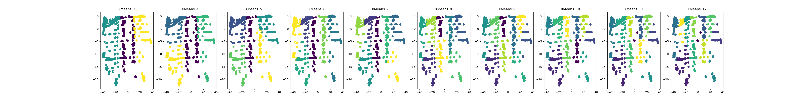
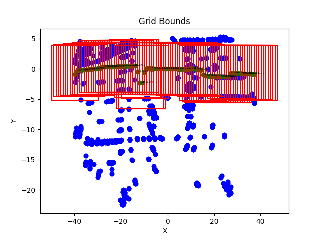
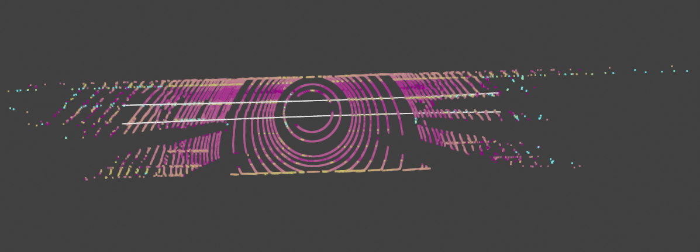

# Ego-Lane Detection Using LiDAR Pointclouds

## Author
Chieh Fei (Jeffee) Hsiung, KU Leuven

## Abstract
This report details the development and implementation of an ego lane detection algorithm using LiDAR pointcloud data without the use of machine learning rather with classical mathmatical modeling. By fitting a 3-degree polynomial to detected lane lines, the algorithm emphasizes robust preprocessing, lane point classification, and curve fitting techniques. This approach aims to accurately detect the ego lane with conventional filtering and polynomial fitting methods that is crucial for the navigation and control of autonomous vehicles.

## 1. Introduction
Accurate detection of ego lane lines is fundamental for the autonomous navigation of vehicles. With advancements in LiDAR technology, high-resolution pointclouds provide a detailed representation of the environment, including road lanes. This report presents an algorithm designed to process such pointcloud data, focusing on detecting ego lanes through a combination of classical data preprocessing, feature extraction, and mathematical modeling.

## 2. Methodology
The algorithm is structured into four main stages: data preprocessing, lane detection, lane marking, and lane fitting. Each stage employs specific techniques and algorithms to isolate lane lines from the pointcloud data and model them accurately.

### 2.1 Data Preprocessing
Data preprocessing is a crucial step in preparing LiDAR pointclouds for the detection of ego lanes. 
The implemented algorithm employs a series of statistically based approach to filter and refine the raw data.
The statistical assumptions are as follows:
- The road elements other than lane markings and ground are significantly above the road surface. This assumptions enable filtering based on z-coordinates.
- The width-between-lanes based on research ranges from 3m to maximum 4m, where as the lane markings is 0.1m to 0.15m. The observation indicates most scatters will be from the ground and should be disregarded. This assumptions enables filtering based on scatter euclidean distance and forming sub-surfaces of the ground plane.

    

<strong>Figure 1</strong>: Lane Width Research [2]

- The lane markings are more reflective than the road surface that the intensity of the lane markings is higher than the road surface. This assumptions enable filtering based on intensity values.

- **Loading Pointclouds with Attributes**: Utilizing Open3D, pointclouds are loaded from binary files, encapsulating spatial information (x, y, z coordinates) and non-spatial attributes (intensity and lidar beam id) crucial for ego lane detection. This initial step ensures a comprehensive dataset is prepared, including assigning a unique scene identifier to each pointcloud for efficient processing and analysis.

- **Ground Plane Segmentation with RANSAC**: The Random Sample Consensus (RANSAC) algorithm is employed to identify the ground plane within the pointcloud data. This step is essential for isolating the road surface and distinguishing it from other elements, such as lane markings and surrounding objects. By fitting a plane to the pointcloud data, the algorithm effectively separates the ground points from the rest of the scene, laying the foundation for subsequent lane detection.

- **DBSCAN Clustering for Initial Lane Point Identification**: DBSCAN algorithm is applied to the system clusters pointcloud based on spatial proximity. While DBSCAN works better with circular shape clusters, the method enables separating the targets into clusteres and label scatters with similar proximity as one. Subsequently, the intensity threshold learning can be learned from per cluster and select a certain percentile threshold. The parameters such as eps (the maximum distance between two samples for one to be considered as in the neighborhood of the other) and min_samples (the number of samples in a neighborhood for a point to be considered as a core point), are learned dynamically from the data.

- **Intensity Threshold Learning**: An innovative step in our system is the dynamic learning of an intensity threshold to filter lane points. By analyzing the clustered points, the algorithm determines an optimal intensity threshold that distinguishes lane markings, typically characterized by higher reflectivity, from other road and non-road elements.

- **Intensity-Based Filtering and Z-Filter**: The algorithm prioritizes points based on their intensity values, which hgih values are hgih associated with lane markings, and discard points that are lower than the learned intensity threshold. Additionally, a z-filter is applied to exclude points that are significantly above the road surface, focusing the analysis on the area where lane markings are present.

### 2.2 Lane Detection
Lane detection is a critical phase where the preprocessed data is analyzed to identify and model the lane boundaries. This phase leverages the logical reasoning to ensure the accurate detection and representation of lanes.

-**Finding Number of Lanes**: The method finds the number of lanes based on the number of intensity peaks, providing a between-peaks width of three. By analyzing the intensity peaks along the y-axis, the algorithm identifies the number of lanes.

- **Optimization of K-Means Clustering**: Post-initial clustering and filtering, K-Means clustering is optimized to segment the lane points into distinct lane segments along the x-axis. The implementation enables a piecewise approximation of the lane curvature that scatters with similar slopes are labeled as a group. Through silhouette analysis, the algorithm determines the optimal number of clusters (lane segments along the x-axis).

    

<strong>Figure 2</strong>: K-Means Clustering for Lane-Slope Grouping

- **Slope Calculation and Orthogonal Slope Filtering**: For each identified lane segment cluster (along the x-axis), the algorithm calculates the slope, aiding in the discrimination of lane directions and orientations. Clusters with slopes nearly orthogonal to the expected lane direction are filtered out, focusing the analysis on plausible lane orientations.

- **Visualization and Verification**: Throughout the lane detection process, `Open3D pointcloud drawing` visualization tools are employed to inspect and verify the accuracy of detected lanes. This includes transforming points to a binary image and employing the Hough Transform to detect lines, providing a visual confirmation of the algorithm's effectiveness.

### 2.3 Lane Marking
Lane marking is a crucial step following lane detection, aimed at defining precise boundaries for where the lanes are located within the point cloud data. This process leverages the detected slopes and segments of the lanes to create a structured grid system that outlines the expected locations of lane boundaries.

- **Grid Dictionary Creation**: The grid generating method within the LaneMarker class constructs a grid dictionary based on the x-coordinates range, considering each lane segment's slope and intercept calculated from previous stage. This dictionary maps grid coordinates to adjusted grid bounds, taking into account the maximum lane width and the number of lanes detected. This structured approach allows for the dynamic adaptation of lane marking to the road's geometry and the vehicle's perspective.

    

Figure 3: Corresponding Grid Creation Based on Segment Slopes

- **Visualization and Verification**: If enabled, the visualization feature plots the point cloud alongside the defined grid bounds, providing a visual confirmation of the lane marking process. This step is invaluable for debugging and verifying that the lane boundaries are accurately captured by the grid system.

- **LiDAR Data Filtering by Grid**: Post grid definition, the filtering by grid method assigns LiDAR data points to the corresponding grid cells. This filtering process isolates points within specific boundaries, enabling focused analysis and modeling of lane lines within these predefined areas.

The lane marking step, with its grid-based approach, significantly enhances the lane detection algorithm's ability to delineate lane boundaries accurately. 

### 2.4 Polynomial Regression Lane Fitting (Fit per lane or Fit all lanes)
The lane detection algorithm employs `RANSACRegressor` with a custom estimator, `Polynomial Regressor`, respectively act as the inliner outlier detection and fits a polynomial to the lane points. The `RANSACRegressor` is a robust method that can fit a 3-degree polynomials to the lane points and remove outliers. The polynomial fitting is performed on the lane points identified in the previous steps, aiming to model the lane boundaries accurately and robustly.

- **Polynomial Model Fitting**: The `fit` method is modified to address the parallelism property between the lanes. For the regular `PolynomialRegression` class, the `fit` concerns only the polynomial fitting of the line; while for the `ParallelPolynomialRegression` class, the `fit` method concerns additionally the customized cost function addressing the need of parallelism property and an appropriate width-between-lanes. 

- **Polynomial Prediction and Scoring**: As an estimator of the `RANSACRegressor` where the `predict` and `score` methods are called to determine a inline and outline classification result, the `score` function, other than computing the mean squared error (MSE) between the predicted lane positions and the actual lane positions, is extended to integrate the a specified cost function.

- **Cost Function for Lane Fidelity**: Additional aspect of the my approach is the cost function defined within the Polynomial Regression class. This function, `cost`, not only considers the mean squared error between the modeled and actual lane widths across a range of x-values but also includes a penalty term for deviations from parallelism between the left and right lane boundaries. The aim is to ensure that the detected lanes are not only accurate in terms of position but also consistent in width and parallel to each other.

## 3. Results
The algorithm was tested on all datasets provided by Seoul Robotics[1]. The preprocessing and lane detection methods demonstrated high effectiveness in isolating and accurately modeling lane lines. Comparative analysis with ground truth data showed that the dynamically created grid allows the polynomial to align closely with the actual lanes, indicating the algorithm's reliability.

    

<strong>Figure 4</strong>: SampleID: 1553565729015329642 Fitting Result

Given visual inspection, the algorithm's performance is
- Optimal when the lane marking scatters are at proximity to each other. 
- Sensitive to the intensity threshold selection, which percentile design per observation. 
- Sensitive to target scatters density and continuity. A sparse distribution of target scatters would lead to incorrect lane curve fitting given the current implementation.
- Suboptimal when multiple orientations of lanes are present in the scene.

`Two` out of the `Eleven` ego lane fitting is inferior than the rest data. 
- One ill-fitted lane, given current simple and classical implementation, is due to the lane marking scatters are not at proximity to each other, which leads to incorrect lane curve fitting.
- The other ill-fitted lane is due to the multiple orientations of lanes are present in the scene, which leads to incorrect lane curve fitting.

## 4. Discussion
The integration of the methods including the inliner and outliner RANSACRegression Class, Polynomial Regression Class, Range-of-Interest Grids Creation in LaneMarking class, and finally the Slope-Calculation in LaneDetection class play a significant role in modeling of lane boundaries from LiDAR pointcloud data. By combining traditional polynomial fitting techniques with a custom cost function that emphasizes lane fidelity and parallelism, the current implementations gives a fair ego lane detection result. However, future work may explore the application of HDMap[3] for curved road ego lane fitting, as well as other advance algorithms that are able to address complex road geometries, including intersections and multi-lane roads.

## 5. Conclusion
This report introduced a systematic approach to ego lane detection from LiDAR pointclouds, highlighting the importance of data preprocessing and advanced polynomial fitting. The methodology and results underscore the algorithm's applicability to autonomous vehicle navigation, offering a foundation for further research and development in this area.

## References
- [1] Seoul Robotics. (2021). 3D Point Cloud Data for Lane Detection. Seoul Robotics. https://www.seoulrobotics.org/
- [2] Global Designing Cities Initiative. (2016). Urban Street Design Guide. https://globaldesigningcities.org/publication/urban-street-design-guide/
- [3] HDMap. (2021). HDMap for Autonomous Vehicles. https://github.com/Tsinghua-MARS-Lab/HDMapNet